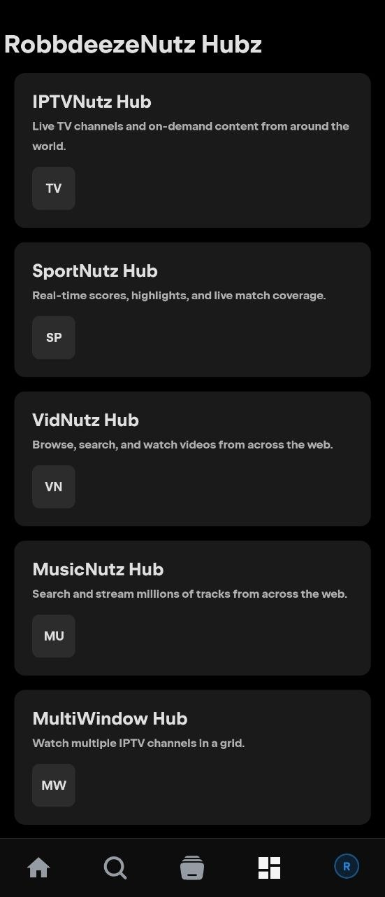
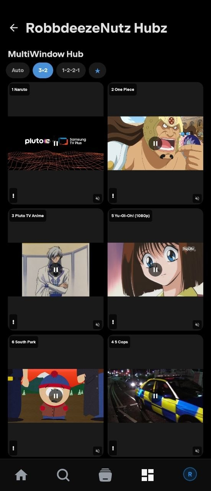
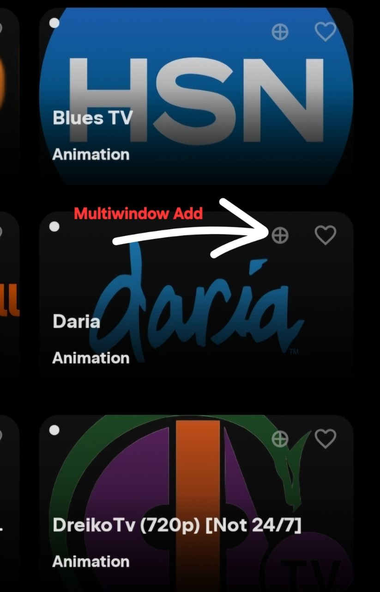
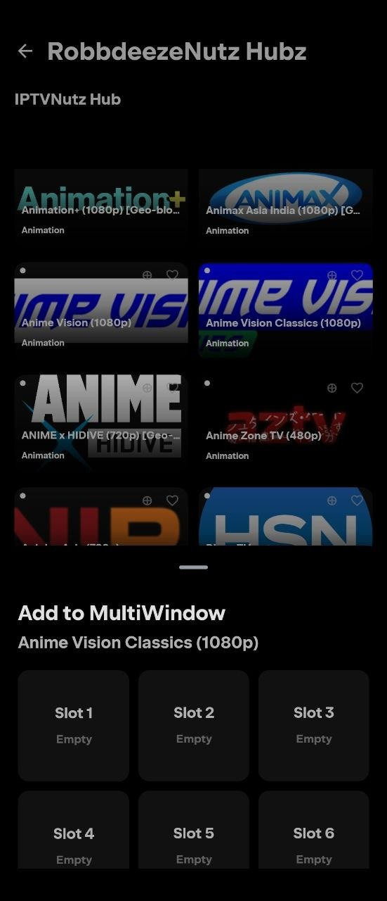

<div align="center">

  
  <br />
  <br />

  [![Stars][stars-shield]][stars-url]
  [![Issues][issues-shield]][issues-url]
  [![Release][release-shield]][release-url]

  <p>
    A community fork of NuvioMobile with the RobbdeezeNutz Hub experience.
    <br />
    IPTVNutz · MultiNutz · SportNutz · VidNutz · MusicNutz — all in one tab.
  </p>

</div>

## About

**RNutz Nuvio** is a fork of [NuvioMobile](https://github.com/NuvioMedia/NuvioMobile) that replaces the old IPTV and Sports tabs with a single **RobbdeezeNutz Hub** containing five sub-hubs: IPTVNutz, MultiNutz, SportNutz, VidNutz, and MusicNutz. Installs alongside the stock Nuvio app — no conflicts.

## Screenshots

<div align="center">
  
  
  
</div>
<div align="center">
  
  
  
</div>
<div align="center">
  
  
  
</div>
<div align="center">
  
  
</div>

<h3 align="center">MultiNutz Hub — Watch up to 9 live streams at once</h3>
<div align="center">
  
  
  
</div>
<div align="center">
  
</div>

## Hubs

### RobbdeezeNutz Hub
The main screen with five glass-style cards. Tap any card to open its sub-hub. The "RobbdeezeNutz Hubz" header stays visible across all screens. Tap the Hubz tab again to return to the main view.

### MultiNutz Hub (New!)
Watch up to 9 live IPTV streams simultaneously in a resizable grid. Tap the "MultiNutz Hub" card from the main hub to open.

#### Quick Start
1. **Add streams** — Open IPTVNutz Hub, long-press any channel, select a slot (1–9) to add it to the grid
2. **Audio focus** — Tap the volume icon on any cell to hear that stream (all others mute)
3. **Change layout** — Tap a layout pill above the grid (2×2, 3×3, 1+2, etc.) to rearrange tiles
4. **Per-cell controls** — Tap ⋮ on any cell to: change channel (CH/History/Favorites), adjust volume (Mute/15/30/45/70/85/Max), change scaling (Fill/Fit/16:9/4:3/Zoom), refresh the stream, swap with another cell, or close it

#### Layouts
18 presets for 2–9 streams: 2×2, 3×3, 1+2, 1-2-1, 1+4, 3+2, 2×3, 1-3-3, 4×2, and more. Layout auto-selects based on stream count and orientation, or you can lock a specific layout.

#### Bulk Actions
- **Mute All** — silence all streams
- **Close All** — remove all streams at once
- **Pause All** — freeze all streams (playback resumes individually)
- **★ Bookmarks** — save your current layout + channels, load them later

#### Push-to-Multi
While watching any IPTV channel full-screen, tap the **Multi** button to send it to the first empty slot in MultiNutz Hub.

### IPTVNutz Hub
Live TV with M3U, Xtream Codes, and Stalker Portal support. Built-in iptv-org source (12,000+ channels). In-player channel overlay with search, source/group filters, favorites, history, and one-tap switching. Long-press any channel to send it to **MultiNutz Hub**.

### SportNutz Hub
Real-time scores and standings from ESPN + TheSportsDB. YouTube highlights, date navigation, team detail pages. Pull-to-refresh and per-date caching. Live/Upcoming game counts with pulsing indicators. Tap **Find Channel** on any event to match it to your IPTV lineup, or send it to **MultiNutz Hub** for side-by-side viewing.

### VidNutz Hub
YouTube video browser with 12 categories (Trending, Politics, News, Music, Sports, etc.). Persistent search with debounce, swipe between categories, Load More for pagination, and full ExoPlayer playback.

### MusicNutz Hub
Browse millions of tracks by genre. Search by song or album. Toggle between Tracks and Albums view. Tap an album to see its full tracklist. Full-length audio via YouTube.

## Download

[Download the latest APK](https://github.com/Robbdeeze/NuvioMobile/releases/download/v0.2.20/androidApp-full-debug.apk) (245 MB)

## Build from source

```bash
./gradlew :androidApp:assembleDebug -Pnuvio.android.distribution=full
```

## Features

- **MultiNutz Hub** — watch up to 9 live streams simultaneously with per-cell controls, audio focus, scaling, swap, and layout bookmarks
- **Push-to-multi** — send any IPTV stream to the multi-view grid with one tap
- **D-pad / TV remote navigation** across all hubs
- **Installs alongside stock Nuvio** — separate package name
- **Monochrome grayscale design** throughout
- **Trakt login** for watch progress sync

## License

GPL-3.0

<!-- MARKDOWN LINKS & IMAGES -->
[stars-shield]: https://img.shields.io/github/stars/Robbdeeze/NuvioMobile.svg?style=for-the-badge
[stars-url]: https://github.com/Robbdeeze/NuvioMobile/stargazers
[issues-shield]: https://img.shields.io/github/issues/Robbdeeze/NuvioMobile.svg?style=for-the-badge
[issues-url]: https://github.com/Robbdeeze/NuvioMobile/issues
[release-shield]: https://img.shields.io/github/v/release/Robbdeeze/NuvioMobile?include_prereleases&style=for-the-badge&label=Release
[release-url]: https://github.com/Robbdeeze/NuvioMobile/releases/latest
